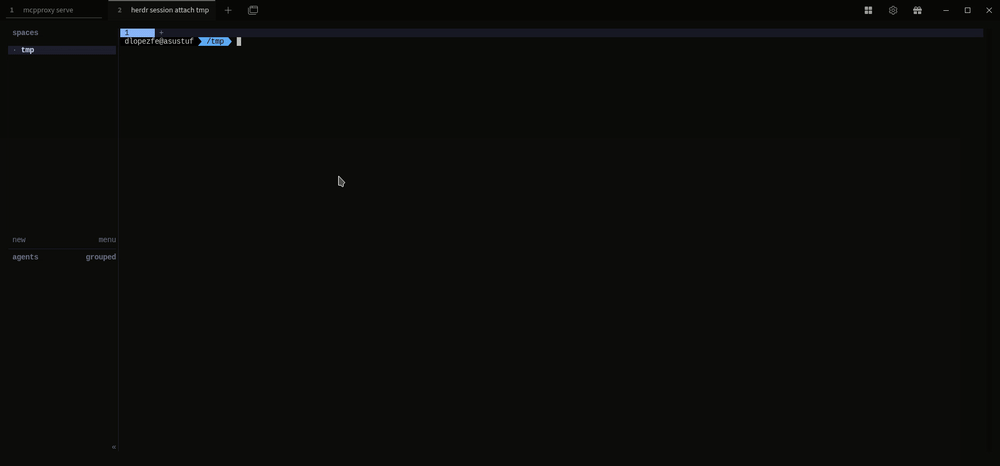

# keymap

A herdr plugin: shows every keybinding (defaults + your `config.toml`
overrides) in an overlay pane, grouped by category, and runs the ones that
have an equivalent in the herdr CLI.

## Demo



## Structure

```
src/
  config.ts      # DEFAULTS (stable channel) + loadEffectiveKeys (parses config.toml)
  herdr-cli.ts    # bridge to the herdr CLI (herdr(), currentWorkspaceId, currentPane)
  actions.ts      # ACTIONS table + executors + CATEGORY_ORDER
  keymap.ts       # entrypoint: category UI → command
test/
  config.test.ts  # defaults/overrides merge
  actions.test.ts # ACTIONS table consistency
```

## Requirements

- Node >= 24 (runs `.ts` natively, no `tsc` or `ts-node`)

## Install

```bash
herdr plugin install The-Dave-Stack/herdr-keymap
```

This clones the repo and runs the build (`npm ci`) automatically. Pass
`--yes` to skip the confirmation preview. (For hacking on a local clone
instead, see [Local development](#local-development) below.)

Then add the keybinding in `~/.config/herdr/config.toml`:

```toml
[[keys.command]]
key = "prefix+m"
type = "plugin_action"
command = "tds.keymap.open_palette"
description = "Keybindings palette"
```

Reload the running server's config:

```bash
herdr server reload-config
```

### New sessions

Plugin registration is **per session** (each session has its own
`plugins.json`) — there is no `--global` on `herdr plugin` (confirmed with
`herdr plugin --help`), and a freshly created session starts with
`plugins: []`, inheriting nothing from other sessions (verified live). This
applies to both `install` and `link`. The `config.toml` keybinding is global
(a single shared file), but without registering the plugin the command can't
find it.

For each new session, repeat the install pointing at that session:

```bash
herdr --session <name> plugin install The-Dave-Stack/herdr-keymap
```

### Local development

To work on the plugin from a local clone, link the path instead of
installing from GitHub:

```bash
herdr plugin link /path/to/keymap
```

After editing the manifest (`herdr-plugin.toml`) or the pane/action
commands, unlink and relink so herdr picks up the change:

```bash
herdr plugin unlink tds.keymap
herdr plugin link /path/to/keymap
```

### `prefix+m` does nothing after editing `config.toml`

`config.toml` is global, but an already-running herdr server does not
re-read its changes on its own. Every time you edit the `[[keys.command]]`
(or any other part of `config.toml`), you must reload each running session:

```bash
herdr --session <name> server reload-config
```

Diagnostic signal: if `herdr plugin action invoke open_palette --plugin
tds.keymap` works but `prefix+m` does nothing, this is it — not a plugin bug.

## Usage

Press `prefix+m` (by default `ctrl+b`, release, then `m`) to open the
palette.

1. Pick a category (`workspace`, `tab`, `worktree`, `pane`, `agent`,
   `general`) — each shows its command count in parentheses.
2. Pick a command within that category, or `❮ Back` to change category.

The `agent` category is special: its entries are herdr `agent` subcommands
(Focus agent, Rename agent), not keybindings, so they show `(cmd)` instead of
a key. They prompt for the target agent via `herdr agent list`.

Running a command (or hitting an error) closes the palette by itself — it is
single-use; reopen with `prefix+m` to do something else. `Esc` or
`Ctrl+C`/`Ctrl+D` cancel cleanly at any point (via `@inquirer/prompts`,
which throws `ExitPromptError` — caught in `keymap.ts`).

There is no on-screen output of the result (herdr has no documented way for
the pane to redirect its own stdout to `herdr plugin log list` — that only
captures `build` failures). Instead, every call to the herdr CLI is logged
to `$HERDR_PLUGIN_STATE_DIR/keymap.log` (verified empirically; exact path
resolved at runtime by herdr).

## What is runnable and what is not

Not every herdr keybinding has a documented CLI equivalent. The ones that
don't are marked in the list as `[no CLI equivalent]` or similar and do
nothing when selected other than warn — no invented/guessed commands.

Runnable: `new_workspace`, `rename_workspace`, `close_workspace`,
`workspace_picker`, `navigate_workspace_up`, `navigate_workspace_down`,
`new_worktree`, `new_tab`, `rename_tab`, `close_tab`, `previous_tab`,
`next_tab`, `switch_tab`, `focus_pane_*`, `split_vertical`,
`split_horizontal`, `close_pane`, `zoom`.

Keyboard-only (client UI/modal, no CLI): `detach`, `toggle_sidebar`,
`copy_mode`, `remote_image_paste`, `goto`, `navigate_pane_*`, `swap_pane_*`,
`cycle_pane_*`, `resize_mode`.

Actions that close something (`close_workspace`, `close_tab`, `close_pane`)
ask for confirmation before running.

## Known caveats

- **Hardcoded defaults table**: the default values are copied from the
  `stable` channel docs (confirmed with `herdr channel show` on the machine
  where this was built). If you switch to the `preview` channel some defaults
  differ (`previous_workspace`, `next_workspace`, `focus_agent`,
  `open_worktree`, `remove_worktree` are assigned on preview, not empty). The
  tests only verify the table's internal consistency, not that it matches the
  actually installed channel.
- **Pane-scoped actions target the originating pane, not the palette.** The
  palette is an overlay pane, so while it is open it is itself the `focused`
  pane — `pane split/focus/zoom/close --current` would act on the palette
  (and splitting an overlay makes herdr ignore `--direction`, so a horizontal
  split came out vertical). These actions instead resolve the pane you came
  from via `HERDR_PLUGIN_CONTEXT_JSON.focused_pane_id`. Workspace/tab actions
  still use `focused: true` from `workspace list` / `tab list`, which is
  correct because the overlay lives in the active workspace/tab.
- `--session` is never passed and `HERDR_SOCKET_PATH`/`HERDR_SESSION` are
  never touched — the runtime already injects the correct socket for the
  session that launched the plugin.

## Test

```bash
node test/config.test.ts
node test/actions.test.ts
```
